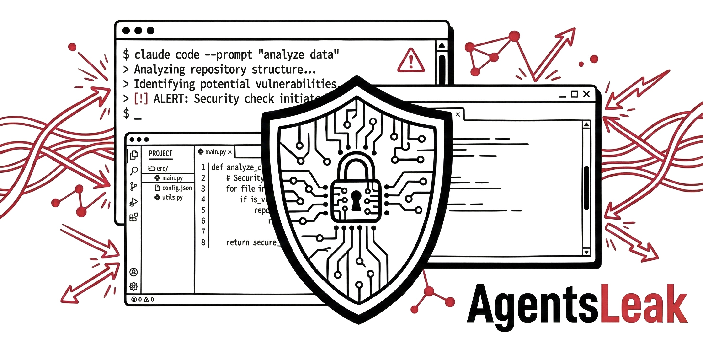

<p align="center">
  
</p>

<p align="center">
  <a href="#quick-start">Quick Start</a> &bull;
  <a href="#architecture">Architecture</a> &bull;
  <a href="#api-reference">API Reference</a> &bull;
  <a href="docs/ARCHITECTURE.md">Docs</a>
</p>

---

AgentsLeak is a lightweight runtime security platform purpose-built for AI coding agents. It monitors file access, network connections, process creation, and command execution — then surfaces anomalies and enables real-time blocking of malicious actions through a security dashboard.

Supporting **Claude Code** and **Cursor** as monitored agents, AgentsLeak brings the same class of monitoring that CrowdStrike, SentinelOne, and Cybereason provide for human endpoints — but tailored for AI agent sessions.

## Why This Exists

AI coding agents read files, execute shell commands, fetch URLs, and write code. But today there's no visibility into *what* they're actually doing at runtime. AgentsLeak fills that gap:

- **Credential theft** — detect agents reading SSH keys, `.env` files, or cloud credentials
- **Reverse shells** — block `bash -i >& /dev/tcp/...` and netcat backdoors before they execute
- **Data exfiltration** — catch `curl` POST requests sending local files to external servers
- **Scope violations** — alert when agents access files outside the project directory
- **Reconnaissance** — detect agents grepping for passwords, secrets, and API keys

## Key Capabilities

| Capability | Description |
|---|---|
| **Real-time event collection** | File reads/writes, bash commands, network requests, process spawning |
| **Session-aware monitoring** | Events grouped by agent session with full context |
| **Policy engine** | Define and enforce security rules per project or organization |
| **Active blocking** | Stop dangerous actions before they execute via PreToolUse hooks |
| **Behavioral sequence detection** | Correlate multi-step attack patterns (e.g. read .env → base64 encode → POST) |
| **Content-based risk scoring** | Dynamic risk analysis from file paths, commands, URLs, and search patterns |
| **Graph visualization** | Interactive dependency graphs with directory clustering and time-window filtering |
| **Live feed** | Real-time WebSocket stream of events and alerts as they happen |
| **Dashboard** | Web interface with dark mode, live feed, alerts, analytics, and session drill-down |
| **Event chain analysis** | Trace the sequence of events leading to each alert |

## Quick Start

Requires **Python 3.11+**, **Node.js 18+**, and **jq**.

```bash
git clone https://github.com/IngaCherny/AgentsLeak.git
cd AgentsLeak
./scripts/start.sh
```

That's it. The start script creates a virtual environment, installs all dependencies, hooks into Claude Code, and launches both the backend (`http://localhost:3827`) and dashboard (`http://localhost:5173`).

> Restart any open Claude Code sessions after installation — existing sessions won't pick up the hooks until restarted.

### Manual setup

If you prefer to set things up step by step:

```bash
# Backend
python3 -m venv .venv && source .venv/bin/activate
pip install -e ".[dev]"
agentsleak --host 127.0.0.1 --port 3827

# Dashboard (in a second terminal)
cd dashboard && npm install && npm run dev

# Install hooks (Claude Code)
./hooks/install.sh

# Install hooks (Cursor v1.7+)
./hooks/install-cursor.sh
```

> Restart any open agent sessions after hook installation to start monitoring.

## Configuration

### Server options

| Flag | Env Var | Default | Description |
|---|---|---|---|
| `--host` | `AGENTSLEAK_HOST` | `127.0.0.1` | Bind address |
| `--port` | `AGENTSLEAK_PORT` | `3827` | Bind port |
| `--db-path` | `AGENTSLEAK_DB_PATH` | `~/.agentsleak/data.db` | SQLite database path |
| `--log-level` | `AGENTSLEAK_LOG_LEVEL` | `INFO` | Log level (DEBUG, INFO, WARNING, ERROR) |
| `--reload` | — | `false` | Auto-reload on code changes (development) |

### Authentication

| Env Var | Protects | Header |
|---|---|---|
| `AGENTSLEAK_API_KEY` | `/api/collect/*` endpoints (hook ingestion) | `X-AgentsLeak-Key: <key>` |
| `AGENTSLEAK_DASHBOARD_TOKEN` | All `/api/*` dashboard routes + WebSocket | `Authorization: Bearer <token>` |

Both are optional. When not set, endpoints are open (dev mode). When `AGENTSLEAK_DASHBOARD_TOKEN` is set, the dashboard shows a login prompt.

```bash
# Example: start with both auth enabled
AGENTSLEAK_API_KEY=hook-secret-123 \
AGENTSLEAK_DASHBOARD_TOKEN=dashboard-secret-456 \
agentsleak --host 0.0.0.0 --port 3827
```

### Policy Assistant (Anthropic Claude SDK)

AgentsLeak includes an AI-powered **Policy Assistant** that can generate detection policies from plain-English descriptions (e.g. *"Block any attempt to read SSH private keys"*). This feature requires the [Anthropic Python SDK](https://github.com/anthropics/anthropic-sdk-python), which is installed automatically as a dependency.

To enable the Policy Assistant, provide your Anthropic API key:

```bash
# Option 1: Create a .env file in the project root (recommended — already gitignored)
echo "ANTHROPIC_API_KEY=sk-ant-..." > .env

# Option 2: Export as an environment variable
export ANTHROPIC_API_KEY=sk-ant-...
```

You can get an API key from the [Anthropic Console](https://console.anthropic.com/). The Policy Assistant uses Claude Sonnet and is entirely optional — all other features work without it.

> **Important:** Never commit your `.env` file or API keys to version control. The `.gitignore` already excludes `.env` files.

### Data storage

All data is stored locally in a SQLite database at `~/.agentsleak/data.db` by default. No external services or cloud dependencies required.

## Multi-Endpoint Deployment (EDR Mode)

AgentsLeak can run as a centralized server receiving events from multiple developer machines — like deploying an EDR agent across endpoints.

```
  Developer A (macOS)              Developer B (Linux)
  ┌──────────────────┐            ┌──────────────────┐
  │  Claude Code     │            │  Cursor           │
  │  + hooks ────────┼──────┐    │  + hooks ─────────┼──────┐
  └──────────────────┘      │    └──────────────────┘      │
                            │                               │
                            ▼                               ▼
                    ┌─────────────────────────────────────────┐
                    │        AgentsLeak Server                 │
                    │        (central machine)                 │
                    │        0.0.0.0:3827                      │
                    │                                         │
                    │  Dashboard shows all endpoints,          │
                    │  filterable by user/hostname              │
                    └─────────────────────────────────────────┘
```

### Server setup (central machine)

```bash
# Bind to all interfaces and set auth keys
AGENTSLEAK_API_KEY=your-hook-secret \
AGENTSLEAK_DASHBOARD_TOKEN=your-dashboard-secret \
agentsleak --host 0.0.0.0 --port 3827
```

### Agent setup (each developer machine)

1. Install hooks normally (Claude Code or Cursor).
2. Point hooks to the central server by editing `~/.agentsleak/config`:

```bash
# ~/.agentsleak/config
AGENTSLEAK_HOST=192.168.1.100    # central server IP
AGENTSLEAK_PORT=3827
AGENTSLEAK_API_KEY=your-hook-secret
```

That's it. The hooks auto-detect hostname and username, so each developer's events appear attributed to their machine in the dashboard. No agent code runs on the server — only the hooks (lightweight bash + curl) run on developer machines.

### Hook configuration reference

| Variable | Default | Description |
|---|---|---|
| `AGENTSLEAK_HOST` | `localhost` | Server hostname or IP |
| `AGENTSLEAK_PORT` | `3827` | Server port |
| `AGENTSLEAK_API_KEY` | *(none)* | API key for collector auth |
| `AGENTSLEAK_SYNC_TIMEOUT` | `0.2` | Timeout for blocking hooks (seconds) |
| `AGENTSLEAK_ASYNC_TIMEOUT` | `5` | Timeout for async hooks (seconds) |
| `AGENTSLEAK_DEBUG` | `0` | Set to `1` to enable debug logging |

Set these in `~/.agentsleak/config` or as environment variables.

## Running the Demo

The demo script simulates a compromised AI coding agent progressively escalating from benign activity to exfiltration — a full Black Hat Arsenal narrative:

```bash
# Start the server first, then in another terminal:
./scripts/demo.sh              # Interactive — press Enter between acts
./scripts/demo.sh --auto       # Non-interactive — runs straight through
./scripts/demo.sh --reset      # Wipe DB and restart server before running
./scripts/demo.sh --reset --auto  # Clean demo, non-interactive
```

The demo walks through six acts:
1. **Normal Development** — reading source files, running tests, git operations (all allowed)
2. **Reconnaissance** — grepping for passwords and secrets, reading `/etc/passwd` (alerts fire)
3. **Credential Theft** — accessing SSH keys, `.env` files, AWS credentials (risk score climbs)
4. **Evasion Attempts** — base64 encoding, Python/Node one-liners, eval obfuscation (caught)
5. **Sequence Detection** — behavioral engine correlates .env read → encode → POST as exfiltration
6. **Blocked** — reverse shells, netcat backdoors, curl|bash, file upload (all blocked)

Open the dashboard at `http://localhost:5173` to watch events and alerts stream in via the Live Feed.

## Architecture

```
┌─────────────────────────────────────────────────────────────────┐
│                        Claude Code                              │
│  ┌──────────┐  ┌───────────┐  ┌──────────┐  ┌──────────────┐   │
│  │PreToolUse│  │PostToolUse│  │ Session  │  │  Subagent    │   │
│  │  Hook    │  │   Hook    │  │Start/End │  │   Start      │   │
│  └────┬─────┘  └─────┬─────┘  └────┬─────┘  └──────┬───────┘   │
└───────┼──────────────┼─────────────┼───────────────┼────────────┘
        │              │             │               │
        ▼              ▼             ▼               ▼
┌─────────────────────────────────────────────────────────────────┐
│                    AgentsLeak Backend                            │
│                                                                 │
│  ┌─────────────┐  ┌──────────────┐  ┌────────────────────────┐  │
│  │  Collector   │─▶│    Engine     │─▶│      Database          │  │
│  │  (FastAPI)   │  │  (Processor)  │  │      (SQLite)          │  │
│  │              │  │              │  │                        │  │
│  │ /pre-tool-use│  │ - Classifier │  │ - Events               │  │
│  │ /post-tool   │  │ - Policies   │  │ - Sessions             │  │
│  │ /session-*   │  │ - Alerts     │  │ - Alerts               │  │
│  └─────────────┘  └──────┬───────┘  │ - Policies             │  │
│                          │          └────────────────────────┘  │
│                          ▼                                      │
│                   ┌──────────────┐                               │
│                   │  WebSocket   │  Real-time push to dashboard  │
│                   └──────────────┘                               │
│                                                                 │
│  REST API: /api/sessions, /events, /alerts, /policies, /graph   │
└─────────────────────────────────────────────────────────────────┘
        │
        ▼
┌─────────────────────────────────────────────────────────────────┐
│                    Dashboard (React)                             │
│                                                                 │
│  ┌───────┐ ┌────────┐ ┌────────┐ ┌───────┐ ┌───────┐ ┌──────┐  │
│  │  Home │ │Sessions│ │ Alerts │ │ Graph │ │Policies│ │ Live │  │
│  └───────┘ └────────┘ └────────┘ └───────┘ └───────┘ └──────┘  │
└─────────────────────────────────────────────────────────────────┘
```

For detailed technical documentation, see [docs/ARCHITECTURE.md](docs/ARCHITECTURE.md).

## API Reference

All API endpoints are prefixed with `/api`. Full interactive docs available at `http://localhost:3827/docs`.

### Core Endpoints

| Method | Endpoint | Description |
|---|---|---|
| `GET` | `/api/health` | Health check |
| `GET` | `/api/overview` | Dashboard summary statistics |

### Sessions

| Method | Endpoint | Description |
|---|---|---|
| `GET` | `/api/sessions` | List sessions (paginated) |
| `GET` | `/api/sessions/{id}` | Session details |

### Events

| Method | Endpoint | Description |
|---|---|---|
| `GET` | `/api/events` | List events (filterable by session, tool, etc.) |
| `GET` | `/api/events/{id}` | Event details |

### Alerts

| Method | Endpoint | Description |
|---|---|---|
| `GET` | `/api/alerts` | List alerts (filterable by session, severity, policy) |
| `GET` | `/api/alerts/{id}` | Alert details |
| `GET` | `/api/alerts/{id}/context` | Event chain leading to alert |
| `PATCH` | `/api/alerts/{id}` | Update alert status |

### Policies

| Method | Endpoint | Description |
|---|---|---|
| `GET` | `/api/policies` | List detection policies (with hit counts) |
| `POST` | `/api/policies` | Create a policy |
| `PATCH` | `/api/policies/{id}` | Update a policy |
| `DELETE` | `/api/policies/{id}` | Delete a policy |

### Graph

| Method | Endpoint | Description |
|---|---|---|
| `GET` | `/api/sessions/{id}/graph` | Session dependency graph (supports `cluster_dirs`, `from_date`, `to_date`) |
| `GET` | `/api/graph/global` | Cross-session relationship graph |

### Collection (Hook Endpoints)

| Method | Endpoint | Description |
|---|---|---|
| `POST` | `/api/collect/pre-tool-use` | PreToolUse hook — may return a block decision |
| `POST` | `/api/collect/post-tool-use` | PostToolUse hook |
| `POST` | `/api/collect/post-tool-use-error` | PostToolUse failure hook |
| `POST` | `/api/collect/session-start` | Session start notification |
| `POST` | `/api/collect/session-end` | Session end notification |
| `POST` | `/api/collect/subagent-start` | Subagent spawn notification |
| `POST` | `/api/collect/subagent-stop` | Subagent completion notification |
| `POST` | `/api/collect/user-prompt-submit` | User prompt submission hook |

### WebSocket

| Endpoint | Description |
|---|---|
| `ws://localhost:3827/api/ws` | Real-time event and alert stream |

## Project Structure

```
AgentsLeak/
├── agentsleak/                 # Python backend
│   ├── api/                    # REST API route handlers
│   │   ├── alerts.py           # Alert CRUD + context endpoint
│   │   ├── events.py           # Event listing and filtering
│   │   ├── graph.py            # Graph data generation
│   │   ├── policies.py         # Policy CRUD + hit counts
│   │   ├── sessions.py         # Session listing and details
│   │   ├── stats.py            # Analytics and statistics
│   │   └── websocket.py        # Real-time WebSocket handler
│   ├── collector/              # Hook event ingestion
│   │   └── routes.py           # Pre/PostToolUse endpoints
│   ├── config/                 # Configuration
│   │   ├── settings.py         # Pydantic settings model
│   │   └── policy_seeder.py    # Default detection rules
│   ├── engine/                 # Detection engine
│   │   ├── processor.py        # Event processing pipeline
│   │   ├── classifier.py       # Threat classification logic
│   │   └── sequence.py         # Behavioral sequence detection
│   ├── models/                 # Pydantic data models
│   │   ├── events.py           # Event schemas
│   │   ├── alerts.py           # Alert schemas
│   │   └── graph.py            # Graph node/edge schemas
│   ├── store/                  # Data persistence
│   │   ├── database.py         # SQLite operations
│   │   └── schema.py           # Table definitions
│   ├── server.py               # FastAPI app factory
│   └── __main__.py             # CLI entry point
├── dashboard/                  # React frontend
│   └── src/
│       ├── api/                # API client, types, React Query hooks
│       ├── components/
│       │   ├── alerts/         # AlertCard, EventChainTree, AttackChain
│       │   ├── charts/         # EventsOverTime (Recharts)
│       │   ├── common/         # TimeAgo, SeverityBadge, LiveIndicator
│       │   ├── graph/          # SessionGraph, GlobalGraph, TimeWindowSlider
│       │   │   └── custom-nodes/  # ReactFlow node components
│       │   ├── layout/         # Shell, Sidebar, Header
│       │   └── sessions/       # SessionCard
│       ├── hooks/              # useWebSocket, useLiveEvents
│       ├── lib/                # Utilities, dark mode hook
│       └── pages/              # Route pages (Dashboard, Alerts, Graph, etc.)
├── hooks/                      # Hook scripts + installers
│   ├── install.sh              # Claude Code hook installer
│   ├── install-cursor.sh       # Cursor hook installer
│   ├── common.sh               # Shared hook utilities
│   └── cursor-hook.sh          # Cursor universal hook adapter
├── tests/                      # Pytest unit tests (104 tests)
├── scripts/                    # start.sh, demo.sh (setup and demo runner)
├── docs/                       # Documentation
│   ├── ARCHITECTURE.md         # Technical architecture
│   └── THREAT_MODEL.md         # Security threat model
└── pyproject.toml              # Python project configuration
```

## Tech Stack

### Backend
- **Python 3.11+** — Runtime
- **FastAPI** — Web framework and REST API
- **Uvicorn** — ASGI server
- **SQLite** — Embedded database (zero external dependencies)
- **Pydantic** — Data validation and settings

### Frontend
- **React 18** — UI framework
- **TypeScript** — Type safety
- **Vite** — Build tool and dev server
- **ReactFlow** — Interactive graph visualization
- **Dagre** — Automatic graph layout
- **Recharts** — Time-series charts
- **TanStack Query** — Server state management
- **Tailwind CSS** — Styling (with dark mode support)
- **Lucide** — Icons

## Development

### Backend development

```bash
# Create and activate virtual environment
python3 -m venv .venv
source .venv/bin/activate

# Install with dev dependencies
pip install -e ".[dev]"

# Run with auto-reload
agentsleak --reload --log-level DEBUG

# Run tests
pytest

# Lint
ruff check agentsleak/
mypy agentsleak/
```

### Frontend development

```bash
cd dashboard

# Install dependencies
npm install

# Start dev server (hot reload)
npm run dev

# Type check
npx tsc -b

# Lint
npm run lint

# Production build
npm run build
```

### Building for production

```bash
# Build the dashboard
cd dashboard && npm run build && cd ..

# Activate venv and start — the backend serves dashboard/dist/ automatically
source .venv/bin/activate
agentsleak --host 0.0.0.0 --port 3827
```

## License

MIT License. See [LICENSE](LICENSE) for details.

---

<p align="center">
  <strong>AGENTS</strong><span style="color:#D90429"><strong>LEAK</strong></span> &mdash; AI Agent Security Monitoring
</p>
